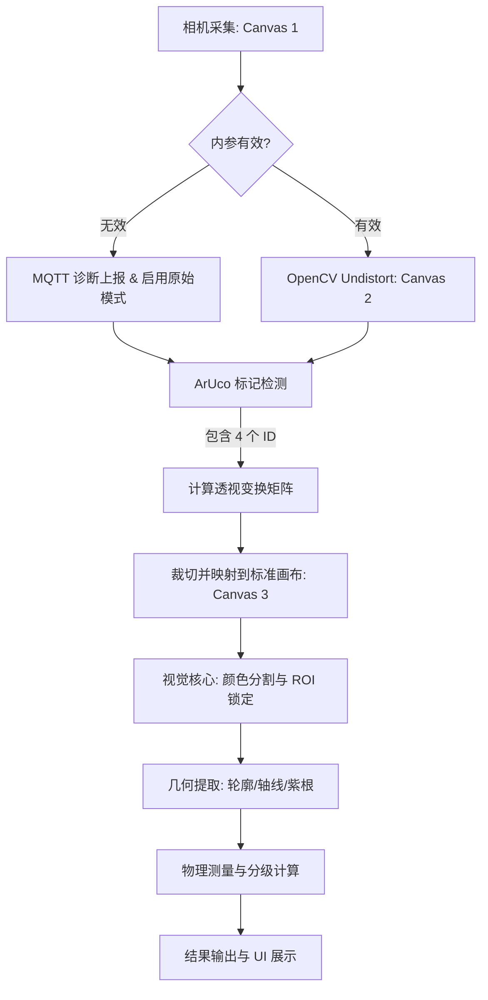

# 芦笋分级视觉测量系统设计手册 (DESIGN_DOC)

## 1. 系统概述
芦笋分级系统（Asparagus Grading System）旨在通过高精度移动视觉技术，自动化测量芦笋的物理特征（直径、长度、颜色比例），并根据工业标准进行实时分级。系统核心采用“三画布”处理架构，确保在不同移动设备硬件上维持统一的测量精度。

---

## 2. 业务需求与测量规格

### 2.1 芦笋生物结构定义
测量时将芦笋从顶至底分为：
1.  **鳞芽 (Head)**: 顶端紧密部分。
2.  **笋体 (Body/Green Stem)**: 绿色茎秆，主要的食用部分。
3.  **紫根 (Purple Root/Butt)**: 茎秆底部由于日照不足或老化呈现紫色/白色的部分。

### 2.2 测量逻辑
- **标准测量点**：位于**绿茎部分的尾部**（即紫根与绿茎分界点）向上 **20mm (2cm)** 处测量直径。若无紫根，则从物理底端向上 20mm 处测量。
- **有效长度**：从鳞芽顶端到紫根起始（变紫点）的物理直线距离。
- **标准分辨率**：系统统一将测量画布标准化为 **10 px/mm**（即 1厘米对应 100像素）。

### 2.3 分级标准
| 等级 | 直径区域 (D) |
| :--- | :--- |
| **A 级** | D > 15.0 mm |
| **B 级** | 12.0 mm < D ≤ 15.0 mm |
| **C 级** | 10.0 mm < D ≤ 12.0 mm |
| **D 级** | 8.0 mm < D ≤ 10.0 mm |
| **E 级** | 5.0 mm < D ≤ 8.0 mm |
| **F 级** | D ≤ 5.0 mm 或识别失败 |

---

## 3. 硬件校准规格 (Calibration Board)

系统通过四个 ArUco 标记定义的物理坐标系进行透视纠正。

- **字典类型**：DICT_4X4_50
- **标记 ID 与位置**：
  - **ID 10**: 左上 (Top-Left)
  - **ID 13**: 右上 (Top-Right)
  - **ID 40**: 右下 (Bottom-Right)
  - **ID 42**: 左下 (Bottom-Left)
- **校准板尺寸**：宽 167mm，高 250mm（标记中心点围成的矩形区域）。

---

## 4. 系统架构：三画布处理管道

为了实现跨设备的“工业级精度”，系统将图像处理分为三个独立的坐标层：

### Canvas 1: 原始采样层 (Raw Sensor)
- **职责**：从 Android Camera2 API 获取高分辨率原始位图。
- **特征**：包含镜头径向畸变（鱼眼效应）和拍摄视角导致的透视形变。

### Canvas 2: 物理去畸变层 (Lens Undistorted)
- **职责**：利用设备导出的 `LENS_INTRINSIC_CALIBRATION` 和 `LENS_DISTORTION` 参数执行物理纠偏。
- **特征**：消除镜头产生的直线变曲线现象，使图像恢复为理想的针孔相机模型。
- **兼容性逻辑**：若硬件返回参数为 0（如部分华为设备），此步骤将跳过（降级为原始模式），并上报诊断数据。

### Canvas 3: 标准化测量层 (Standardized/Warped)
- **职责**：基于四个 ArUco 标记的位置执行透视变换。
- **规格**：分辨率固定为 **1670 x 2500 像素**。
- **特征**：图像纠正为标准俯视图。标定板外部背景将被强制裁切丢弃，仅保留 167x250mm 的核心检测区。
- **演进预告 (V2)**：针对 Canvas 3 在 3D 投影上的局限性（倾斜视角下的直径失真），系统正在评估基于 3D 位姿解算的 **V2 算法**。详细分析请参阅：[ANALYSIS_ALGO_V2_3D.md](file:///d:/Software/antigravity/phone_sorter/docs/ANALYSIS_ALGO_V2_3D.md)。
- **工作流增强 (Level 2)**：针对检测抖动，引入基于时间轴的多帧采样平均方案。详细评估请参阅：[ANALYSIS_WORKFLOW_LEVEL2.md](file:///d:/Software/antigravity/phone_sorter/docs/ANALYSIS_WORKFLOW_LEVEL2.md)。

---

## 5. 代码逻辑流程 (Code Flowchart)

---

## 6. 诊断预览模式 (Diagnostic View Selector)

用户可以通过菜单切换不同的视觉反馈模式，用于调试与验证：

| 模式 | 显示画布 | 叠加层内容 (Overlay) | 目的 |
| :--- | :--- | :--- | :--- |
| **视图 1 (Raw)** | Canvas 1 | 无 | 查看相机原生采样质量与对焦状态。 |
| **视图 2 (Corrected)** | Canvas 2 | ArUco 标记四边形 + ID | 验证镜头去畸变效果及标记检测稳定性。 |
| **视图 3 (Analysis)** | **Canvas 3** | 芦笋轮廓、采样直径线、测量结果 | **核心测量视图**。直接展示标准比例下的分析结果。 |

---

## 7. 软硬件兼容性与诊断

### 7.1 无效内参预警
当设备无法通过系统 API 获取有效校准数据（即焦距、主点全为 0）时，系统将：
1.  **静默上报**：通过 MQTT 将 `Build.MODEL` 和 `InvalidIntrinsic` 状态发送给服务器。
2.  **用户告知**：弹出一次性对话框告知可能存在 10%-15% 的精度偏差。
3.  **模式切换**：停止 Canvas 2 的纠偏计算，直接从 Canvas 1 映射至 Canvas 3。

### 7.2 多镜头动态同步与兜底机制
核心目标是防止多镜头切换导致的参数偏移：
1.  **逐帧同步**：系统优先从每一帧的 `CaptureResult` 中提取实时的 `LENS_INTRINSIC_CALIBRATION`。
2.  **物理参数兜底**：若设备不公开标定参数，系统将利用 `SENSOR_INFO_PHYSICAL_SIZE` 和 `LENS_INFO_AVAILABLE_FOCAL_LENGTHS` 计算估算内参。

### 7.3 MQTT 上报详情
- **Broker**: `voicevon.vicp.io:1883`
- **Topic**: `phone_sorter/${brand}/${type}/0/result`

---

## 8. 开发者工作流
1.  **编译部署**：使用 `./gradlew.bat assembleDebug` 构建，`adb install` 部署。
2.  **实时监控**：使用 `adb logcat -s AlgorithmProcessor -s MqttReporter` 观察视觉管道与上报状态。
3.  **坐标调试**：利用“视图 3”验证 `TARGET_TL` 到 `TARGET_BR` 的映射是否完美覆盖实物。
