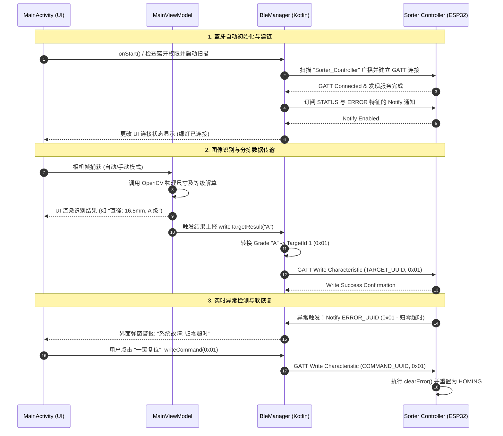

# 芦笋分级手机端 (phone_sorter) 与 ESP32 控制器 (sorter_mini_controller) 蓝牙通信集成方案

## 1. 架构概述

本项目旨在实现一个由 **Android 手机摄像头/CV 算法（主控/决策端）** 与 **ESP32 步进电机控制器（从控/执行端）** 构成的分布式智能分拣系统。
*   **主控决策端 (phone_sorter)**: 运行于 Android 原生系统。通过手机摄像头抓取图像并运行 3D 位姿与 OpenCV 直径测量算法，实时识别出芦笋等级，并通过 BLE 蓝牙协议将分拣目标槽位 ID 写入 ESP32。
*   **从控执行端 (sorter_mini_controller)**: 运行于 ESP32 芯片。配置为 BLE 外设服务器，接收分拣目标 ID，驱动 8 路步进电机及移位寄存器总线，将芦笋推送至对应物理槽位。

---

## 2. 蓝牙协议设计 (BLE Profile)

双方遵循统一的自定义 BLE 服务和特征值定义进行交互：

| 组件 / 服务 / 特征 | UUID | 属性 (Property) | 数据格式 (Data Format) | 说明 |
| :--- | :--- | :--- | :--- | :--- |
| **分拣机服务 (Service)** | `1c95d5e3-d8f7-413a-bf3d-7a2e5d7be87e` | - | - | 唯一系统服务标识 |
| **目标特征 (TARGET)** | `1c95d5e3-d8f7-413a-bf3d-7a2e5d7be87d` | `WRITE` | `uint8` (1 字节) | 分拣目标槽位 ID (范围 `1-8`)，手机端识别成功后写入此特征 |
| **状态特征 (STATUS)** | `1c95d5e3-d8f7-413a-bf3d-7a2e5d7be87c` | `READ`, `NOTIFY` | `uint8` (1 字节) | ESP32 控制器实时运行状态码 (如 `0=IDLE`, `1=HOMING`, `2=RUNNING`, `3=ERROR`) |
| **错误特征 (ERROR)** | `2c95d5e3-d8f7-413a-bf3d-7a2e5d7be87e` | `READ`, `NOTIFY` | `uint8` (1 字节) | ESP32 控制器实时硬件错误码 (如 `0=NONE`, `1=TIMEOUT`, `2=JAM`) |
| **指令特征 (COMMAND)** | `3c95d5e3-d8f7-413a-bf3d-7a2e5d7be87e` | `WRITE` | `uint8` (1 字节) | 手机端下发的系统维护指令 (`0x01=清除错误并重新归零`, `0x02=强制开始归零`) |

---

## 3. 分级结果到分拣槽位映射逻辑 (Target Mapping)

OpenCV CV 算法对芦笋进行直径分析后，会在 `GradingConfig` 产生等级信息。我们将这些等级与 ESP32 分拣机的 8 个物理目标槽位进行映射绑定：

```kotlin
/**
 * 分级结果与分拣机槽位映射器
 */
object SorterTargetMapper {
    fun mapGradeToTargetId(grade: String): Int {
        return when (grade) {
            "A" -> 1  // 特大级 -> 槽位 1 (M0 电机剔除)
            "B" -> 2  // 大级   -> 槽位 2 (M1 电机剔除)
            "C" -> 3  // 中级   -> 槽位 3 (M2 电机剔除)
            "D" -> 4  // 小级   -> 槽位 4 (M3 电机剔除)
            "E" -> 5  // 特小级 -> 槽位 5 (M4 电机剔除)
            "F" -> 8  // 不合格 -> 槽位 8 (M7 电机剔除，或作为次品集中收集槽)
            else -> 0 // 异常数据 -> 不放行/直接通过
        }
    }
}
```

---

## 4. Android 手机端 BLE 核心架构设计

Android 端的蓝牙机制将内聚于新建的 `bluetooth` 模块中，提供高度健壮的自动重连、状态流、以及特征写入接口。

```
phone_sorter/src/android/app/src/main/java/com/example/asparagusclassifier/
├── bluetooth/
│   ├── BleManager.kt       # BLE 蓝牙连接生命周期与读写特征管理器 (核心)
│   └── SorterTargetMapper.kt # 等级与槽位 ID 映射定义
```

### 4.1 Android 蓝牙扫描与连接状态机

`BleManager` 内部维护一个反应式连接状态机，通过 Kotlin `StateFlow` 向 UI 层 and ViewModel 暴露当前的连接状况：

```
      ┌───────────────┐ 扫描到匹配外设 ┌──────────────┐
      │  DISCONNECTED ├──────────────>│  CONNECTING  │
      └───────▲───────┘               └──────┬───────┘
              │                              │
     连接断开 │                              │ GATT 连接成功
     /重连失败│                              │
              │                              ▼
      ┌───────┴───────┐ 发现服务完毕 ┌──────────────┐
      │   CONNECTED   │<─────────────┤  DISCOVERED  │
      └───────────────┘              └──────────────┘
```

### 4.2 核心组件交互流程



---

## 5. 开发实施步骤规划

我们将集成计划划分为 3 个迭代里程碑：

### Milestone 1: 权限适配与连接基础配置 (1天)
*   **Android 权限申请**: 
    在 `AndroidManifest.xml` 中配置 Android 12+ 运行时权限：`BLUETOOTH_SCAN`（带 `neverForLocation` 标记以保护隐私）、`BLUETOOTH_CONNECT`；针对旧机型保留 `BLUETOOTH`、`BLUETOOTH_ADMIN` 及 `ACCESS_FINE_LOCATION`。
*   **自动扫描与过滤**:
    基于 `BluetoothLeScanner` 并在 `ScanFilter` 中增加 `ServiceUUID` 过滤，确保**只对我们独有的分拣机设备发起自动建链**，杜绝误连。

### Milestone 2: BLE 核心驱动编写与映射打通 (2天)
*   **状态监测订阅**:
    实现 `BluetoothGattCallback`，重写 `onConnectionStateChange`、`onServicesDiscovered` 及 `onCharacteristicChanged` 方法。自动为 `STATUS` 和 `ERROR` 特征注册 `BLE2902` 描述符以启用硬件级 Notify。
*   **分拣决策自动下发**:
    在 `MainActivity.kt` 的 `displayResult()` 识别逻辑出口中插入事件挂钩，在 `AlgorithmResult.success == true` 时，自动调用后台蓝牙队列下发对应的 Target ID 字节。

### Milestone 3: 故障交互界面与联调优化 (1.5天)
*   **连接看板 UI 设计**:
    在主界面的控制栏设计一个紧凑的高保真圆形状态指示灯（未连接：红色闪烁，连接中：黄色，已连接：常绿），并增加一个 "连接控制" 侧边菜单。
*   **软复位交互**:
    当监听到 ESP32 通过 `ERROR_UUID` 投递了非零值时，自动弹出底栏警报面板，允许操作人员在手机端直接发送 `0x01` 系统指令进行硬件复归，完全闭环软恢复链路。

---
*本方案由 Antigravity 架构师团队精心设计，专为冯氏芦笋视觉分拣系统定制，具备极高的稳定性和实时响应特性。*
