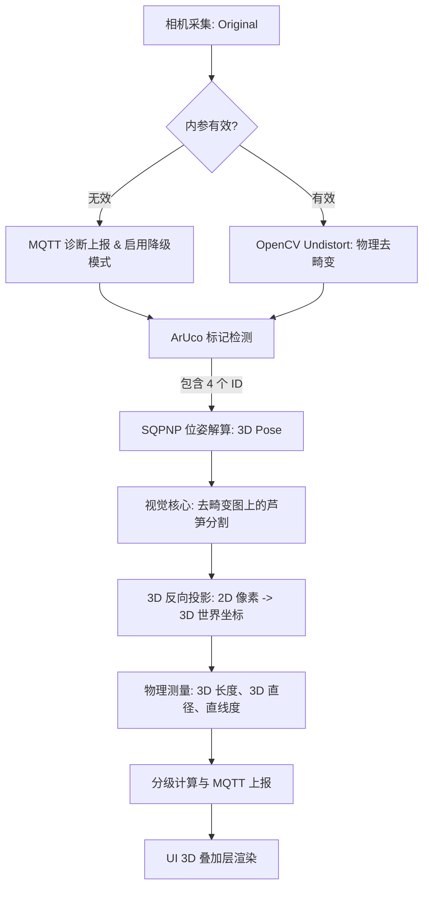

# 数据流与 3D 位姿实时处理逻辑 (DATA_FLOW)

本系统采用高效的异步数据流与 3D 几何建模架构，确保在 Android 移动端实现高精度的实时视觉分析。

## 1. 核心处理流程 (Algorithm Pipeline)

系统将每一帧图像的处理分为以下阶段：

## 2. 实时性优化策略：最新帧优先机制

为了在保持高分辨率采集的同时，确保测量的实时性，系统采用了“生产者-消费者”模型与“过期帧清理”策略：

### 2.1 处理逻辑
1.  **生产者 (Camera Thread)**：持续产生图像帧并放入双端队列。
2.  **消费者 (Analysis Thread)**：在准备开始新一轮计算时，**直接取出队列中最新的一帧**。
3.  **垃圾清理 (Garbage Clearing)**：**丢弃队列中所有堆积的老旧帧**。
4.  **收益**：
    - **极低延迟**：分析结果始终反映传感器当前捕捉到的画面。
    - **系统稳定**：防止算法耗时波动导致的图像处理积压。

## 3. 3D 几何建模与测量

系统不再依赖简单的透视变换裁剪（Canvas 3），而是通过位姿解算在 3D 空间中进行物理推算：

- **直径测量**：基于相机到芦笋的实时 3D 距离（Z 轴距离），结合相机内参计算像素对应的物理毫米数。
- **长度测量**：将 2D 轮廓上的端点映射到 3D 空间（假设芦笋中心面高度为 Z=8mm），计算两点间的欧氏距离。
- **抗抖动**：采用 SQPNP 算法获得稳健的旋转与平移矩阵，确保 3D 坐标轴在画面中不发生剧烈跳动。
